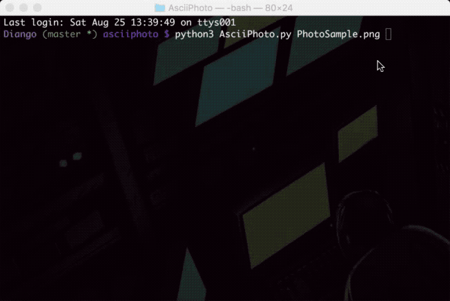

<p align="center">
 </p>

<p align="center">
  <a href="https://www.python.org/">
  
  </a>
  <a href="https://github.com/c0d3x27/AsciiPhoto/blob/master/LICENSE">
  
  </a>
  <br/>
</p>

# Convert Photos into Ascii images using Python


## Contents
- [What AsciiPhoto is?](#what-asciiphoto-is)
- [How AsciiPhoto works](#how-asciiphoto-works)
- [How to use AsciiPhoto](#how-to-use-asciiphoto)
- [Future Plans](#future-plans)

# What AsciiPhoto is?

**AsciiPhoto** is a python script that takes in as input an image, and returns a text output that resembles the input image. In other words, it replicates an image with certain characters.

- For example, when the following image of Instagram logo -

<p align="center">
 </p>

is passed as a parameter into **AsciiPhoto**, the following output is observed -
```
,,,,,,,,?@@@@@@@@@@@@@@@@@@@@@@@@@@@@@@@@@@@@@@@@@@?,,,,,,,,
,,,,,,@@@@@@@@@@@@@@@@@@@@@@@@@@@@@@@@@@@@@@@@@@@@@@@@,,,,,,
,,,,@@@@@@@@@@@@@@@@@@@@@@@@@@@@@@@@@@@@@@@@@@@@@@@@@@@@,,,,
,,,@@@@@@@@@@@@@@@@@@@@@@@@@@@@@@@@@@@@@@@@@@@@@@@@@@@@@@,,,
,,@@@@@@@@@@@@@@@@@@@@@@@@@@@@@@@@@@@@@@@@@@@@@@@@@@@@@@@@,,
,:@@@@@@,,,,,,,,,,,,,,,,,,,,,,,,,,,,,,,,,,,,,,,,,,,,@@@@@@,,
,@@@@@%,,,,,,,,,,,,,,,,,,,,,,,,,,,,,,,,,,,,,,,,,,,,,,S@@@@@,
,@@@@@,,,,,,,,,,,,,,,,,,,,,,,,,,,,,,,,,,,,,,:@@@@@@@*,@@@@@,
%@@@@,,,,,,,,,,,,,,,,,,,,,,,,,,,,,,,,,,,,,,,@@@@@@@@@,,@@@@?
@@@@@,,,,,,,,,,,,,,,,,,,,,,,,,,,,,,,,,,,,,,,@@@@@@@@@,,@@@@@
@@@@@,,,,,,,,,,,,,,,,,,,,,,,,,,,,,,,,,,,,,,,@@@@@@@@@,,@@@@@
@@@@@,,,,,,,,,,,,,,,,,,,,,,:*SS*:,,,,,,,,,,,@@@@@@@@@,,@@@@@
@@@@@,,,,,,,,,,,,,,,,,,,*@@@@@@@@@@*,,,,,,,,@@@@@@@@@,,@@@@@
@@@@@,,,,,,,,,,,,,,,,,@@@@@@@@@@@@@@@@,,,,,,@@@@@@@@@,,@@@@@
@@@@@,,,,,,,,,,,,,,,@@@@@@@@@@@@@@@@@@@@,,,,@@@@@@@@@,,@@@@@
@@@@@,,,,,,,,,,,,,S@@@@@@@@@@@@@@@@@@@@@@%,,,@@@@@@@:,,@@@@@
@@@@@,,,,,,,,,,,,+@@@@@@@@@*,,,,*@@@@@@@@@;,,,,,,,,,,,,@@@@@
@@@@@,,,,,,,,,,,+@@@@@@@,,,,,,,,,,,:@@@@@@@;,,,,,,,,,,,@@@@@
@@@@@,,,,,,,,,,S@@@@@@,,,,,,,,,,,,,,,,@@@@@@%,,,,,,,,,,@@@@@
@@@@@,,,,,,,,,,@@@@@@,,,,,,,,,,,,,,,,,,@@@@@@,,,,,,,,,,@@@@@
@@@@@,,,,,,,,,@@@@@@,,,,,,,,,,,,,,,,,,,,@@@@@@,,,,,,,,,@@@@@
@@@@@@@@@@@@@@@@@@@,,,,,,,,;#@@@;,,,,,,,,@@@@@@@@@@@@@@@@@@@
@@@@@@@@@@@@@@@@@@,,,,,,,:,,#@@@@@S,,,,,,,@@@@@@@@@@@@@@@@@@
@@@@@@@@@@@@@@@@@@,,,,,,,,,,,,@@@@@@,,,,,,@@@@@@@@@@@@@@@@@@
@@@@@@@@@@@@@@@@@,,,,,,,,,,,,,*@@@@@@,,,,,:@@@@@@@@@@@@@@@@@
@@@@@@@@@@@@@@@@@,,,,,:,,,,,,,,@@@@@@S,,,,,@@@@@@@@@@@@@@@@@
@@@@@@@@@@@@@@@@@,,,,,,,,,,,,,,@@@@@@@,,,,,@@@@@@@@@@@@@@@@@
@@@@@@@@@@@@@@@@+,,,,:,,,,,,,,,@@@@@@@;,,,,*@@@@@@@@@@@@@@@@
@@@@@@@@@@@@@@@@,,,,,_S,,,,,,,,@@@@@@@@,,,,,@@@@@@@@@@@@@@@@
@@@@@@@@@@@@@@@@,,,,,@@,,,,,,,@@@@@@@@@,,,,,@@@@@@@@@@@@@@@@
@@@@@@@@@@@@@@@@,,,,,@@@*,,,,@@@@@@@@@@,,,,,@@@@@@@@@@@@@@@@
@@@@@@@@@@@@@@@@,,,,,@@@@@@@@@@@@@@@@@@,,,,,@@@@@@@@@@@@@@@@
@@@@@@@@@@@@@@@@+,,,,;@@@@@@@@@@@@@@@@;,,,,*@@@@@@@@@@@@@@@@
@@@@@@@@@@@@@@@@@,,,,,@@@@@@@@@@@@@@@@,,,,,@@@@@@@@@@@@@@@@@
@@@@@@@@@@@@@@@@@,,,,,S@@@@@@@@@@@@@@S,,,,,@@@@@@@@@@@@@@@@@
@@@@@@@@@@@@@@@@@,,,,,,@@@@@@@@@@@@@@,,,,,:@@@@@@@@@@@@@@@@@
@@@@@@@@@@@@@@@@@@,,,,,,@@@@@@@@@@@@,,,,,,@@@@@@@@@@@@@@@@@@
@@@@@@@@@@@@@@@@@@,,,,,,,S@@@@@@@@S,,,,,,,@@@@@@@@@@@@@@@@@@
@@@@@@@@@@@@@@@@@@@,,,,,,,,;@@@_;,,,,,,,,@@@@@@@@@@@@@@@@@@@
@@@@@@@@@@@@@@@@@@@@,,,,,,,,,,,,,,,,,,,,@@@@@@@@@@@@@@@@@@@@
@@@@@@@@@@@@@@@@@@@@@,,,,,,,,,,,,,,,,,,@@@@@@@@@@@@@@@@@@@@@
@@@@@@@@@@@@@@@@@@@@@@,,,,,,,,,,,,,,,,@@@@@@@@@@@@@@@@@@@@@@
@@@@@@@@@@@@@@@@@@@@@@@@,,,,,,,,,,,:@@@@@@@@@@@@@@@@@@@@@@@@
@@@@@@@@@@@@@@@@@@@@@@@@@@@+,,,,*@@@@@@@@@@@@@@@@@@@@@@@@@@@
@@@@@@@@@@@@@@@@@@@@@@@@@@@@@@@@@@@@@@@@@@@@@@@@@@@@@@@@@@@@
@@@@@@@@@@@@@@@@@@@@@@@@@@@@@@@@@@@@@@@@@@@@@@@@@@@@@@@@@@@@
@@@@@@@@@@@@@@@@@@@@@@@@@@@@@@@@@@@@@@@@@@@@@@@@@@@@@@@@@@@@
@@@@@@@@@@@@@@@@@@@@@@@@@@@@@@@@@@@@@@@@@@@@@@@@@@@@@@@@@@@@
@@@@@@@@@@@@@@@@@@@@@@@@@@@@@@@@@@@@@@@@@@@@@@@@@@@@@@@@@@@@
@@@@@@@@@@@@@@@@@@@@@@@@@@@@@@@@@@@@@@@@@@@@@@@@@@@@@@@@@@@@
@@@@@@@@@@@@@@@@@@@@@@@@@@@@@@@@@@@@@@@@@@@@@@@@@@@@@@@@@@@@
%@@@@@@@@@@@@@@@@@@@@@@@@@@@@@@@@@@@@@@@@@@@@@@@@@@@@@@@@@@?
,@@@@@@@@@@@@@@@@@@@@@@@@@@@@@@@@@@@@@@@@@@@@@@@@@@@@@@@@@@,
,@@@@@@@@@@@@@@@@@@@@@@@@@@@@@@@@@@@@@@@@@@@@@@@@@@@@@@@@@@,
,,@@@@@@@@@@@@@@@@@@@@@@@@@@@@@@@@@@@@@@@@@@@@@@@@@@@@@@@@,,
,,@@@@@@@@@@@@@@@@@@@@@@@@@@@@@@@@@@@@@@@@@@@@@@@@@@@@@@@@,,
,,,@@@@@@@@@@@@@@@@@@@@@@@@@@@@@@@@@@@@@@@@@@@@@@@@@@@@@@,,,
,,,,@@@@@@@@@@@@@@@@@@@@@@@@@@@@@@@@@@@@@@@@@@@@@@@@@@@@,,,,
,,,,,:@@@@@@@@@@@@@@@@@@@@@@@@@@@@@@@@@@@@@@@@@@@@@@@@,,,,,,
,,,,,,,,%@@@@@@@@@@@@@@@@@@@@@@@@@@@@@@@@@@@@@@@@@@?,,,,,,,,
```

-------------------------------------------------------------------------------------------------------
# How AsciiPhoto works

AsciiPhoto works in a rather simple and intuitive way. Here's the algorithm -

  -  Resize the image to a standard dimension, while maintaining aspect ratio
  -  Convert to grayscale (the reason for doing so is because characters are replaced based on their intensity)
  -  Create list of special characters to replace pixels with
  -  Classify and divide pixels into buckets or groups, based on their intensity
  -  Replace all pixels in a bucket with the corresponding special character
  -  Print the text into terminal or write into a file
  -  Done

-------------------------------------------------------------------------------------------------------
# How to use AsciiPhoto

Clone the project
```bash
  $ git clone https://github.com/c0d3x27/AsciiPhoto.git
```
Go to the project directory
```bash
  $ cd AsciiPhoto
```
Install dependencies
```bash
  $ pip install pillow
```
Run the python script, and pass the image path as the parameter
```bash
  $ python AsciiPhoto.py `image_path`
```
The script will print the output in the terminal, and will also write into a file `img.txt` in the same directory as the `AsciiPhoto.py`

Done! 

-------------------------------------------------------------------------------------------------------
# Future Plans

  -  Alternatively support colored outputs by printing the text onto an image
